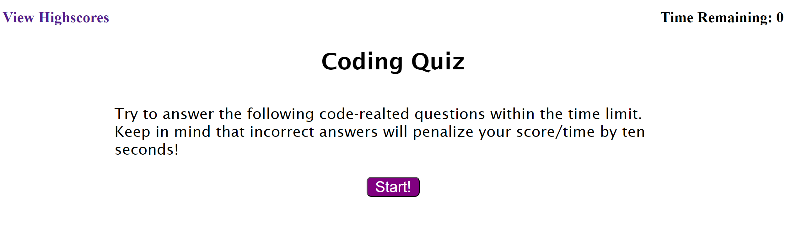

# 04-code-quiz

## Description

html, css and JS for an html code quiz

## Usage
link to high score in top left corner, timer in top right corner counts down after quiz is started. score is time remaining after completing 5 questions.  
Uses local storage to maintain high score list with 3 character initial storage for leaderboard.

https://treblotnad.github.io/04-code-quiz/

## Credits

Compare function used for displaying scores in order taken from:
https://www.programiz.com/javascript/examples/sort-array-objects

## License

Please refer to the License in the repo.
